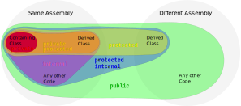

# Modificadores de Acesso em C# 🔒



## Sobre Assembly:

- **Same Assembly**: Refere-se a código que está no mesmo arquivo compilado, como um `.dll` ou `.exe`. Todos os componentes, como classes e métodos, dentro do mesmo assembly têm acesso uns aos outros, dependendo de seus modificadores de acesso (`public`, `private`, `internal`, etc.).


- **Different Assembly**: Refere-se a código que está em arquivos compilados diferentes, como quando você usa uma biblioteca externa (`.dll`). Para que um código em um different assembly acesse componentes em outro assembly, esses componentes precisam ser declarados como `public`.

## O que são Modificadores de Acesso?

Modificadores de acesso em C# são palavras-chave usadas para definir a visibilidade e o escopo de classes, métodos, propriedades e outros membros dentro do código. Eles controlam quais partes do código podem acessar ou modificar esses membros, ajudando a manter a segurança e integridade do código.

## Tipos de Modificadores de Acesso

C# oferece quatro principais modificadores de acesso:

### 1. `public`

- **Descrição**: O modificador `public` torna o membro acessível a partir de qualquer outro código, seja no mesmo assembly ou em assemblies diferentes.
- **Uso comum**: Usado para expor métodos, propriedades e classes que devem ser acessíveis por qualquer outro código.

```csharp
public class MyClass
{
    public void MyMethod()
    {
        Console.WriteLine("Este método é público!");
    }
}
```

### 2. `private`

- **Descrição**: O modificador `private` restringe o acesso ao membro apenas à classe em que ele está definido. Nenhum código fora dessa classe pode acessá-lo.
- **Uso comum**: Usado para encapsular dados e lógica que não devem ser acessados diretamente de fora da classe.

```csharp
public class MyClass
{
    private int myValue;

    private void MyPrivateMethod()
    {
        Console.WriteLine("Este método é privado!");
    }
}
```

### 3. `protected`

- **Descrição**: O modificador `protected` permite que o membro seja acessado na classe onde foi definido e em qualquer classe derivada (subclasse).
- **Uso comum**: Usado em cenários de herança, onde subclasses precisam acessar membros definidos na classe base.

```csharp
public class BaseClass
{
    protected void MyProtectedMethod()
    {
        Console.WriteLine("Este método é protegido!");
    }
}

public class DerivedClass : BaseClass
{
    public void CallProtectedMethod()
    {
        MyProtectedMethod();
    }
}
```

### 4. `internal`

- **Descrição**: O modificador `internal` torna o membro acessível apenas dentro do mesmo assembly, mas não fora dele. É uma forma intermediária entre `public` e `private`.
- **Uso comum**: Usado para expor membros a outras partes do mesmo projeto, mas ocultá-los de outros projetos.

```csharp
internal class MyInternalClass
{
    internal void MyInternalMethod()
    {
        Console.WriteLine("Este método é interno!");
    }
}
```

### 5. `protected internal`

- **Descrição**: Combina `protected` e `internal`, permitindo que o membro seja acessado dentro do mesmo assembly ou por classes derivadas em outros assemblies.
- **Uso comum**: Usado em cenários onde você deseja expor membros para subclasses, independentemente de estarem no mesmo assembly ou em assemblies diferentes.

```csharp
protected internal void MyProtectedInternalMethod()
{
    Console.WriteLine("Este método é protegido interno!");
}
```

### 6. `private protected`

- **Descrição**: Combina `private` e `protected`, permitindo que o membro seja acessado apenas dentro da classe onde foi definido e por subclasses, mas somente dentro do mesmo assembly.
- **Uso comum**: Usado para restringir o acesso a subclasses no mesmo assembly, evitando acesso de fora do assembly.

```csharp
private protected void MyPrivateProtectedMethod()
{
    Console.WriteLine("Este método é privado protegido!");
}
```

## Quando Usar Cada Modificador?

- **Use `public`** quando precisar que outros códigos, incluindo outros assemblies, acessem o membro.
- **Use `private`** para proteger dados e métodos que não devem ser acessados diretamente de fora da classe.
- **Use `protected`** para permitir que subclasses acessem membros da classe base.
- **Use `internal`** para expor membros dentro do mesmo assembly, mas ocultá-los de outros assemblies.
- **Use `protected internal`** quando precisar de um acesso mais flexível, disponível para subclasses e dentro do mesmo assembly.
- **Use `private protected`** para um nível de proteção alto, limitando o acesso a subclasses dentro do mesmo assembly.

## Documentação Oficial 📚

Para mais detalhes sobre modificadores de acesso em C#, consulte a [Documentação Oficial do C#](https://learn.microsoft.com/dotnet/csharp/programming-guide/classes-and-structs/access-modifiers).
